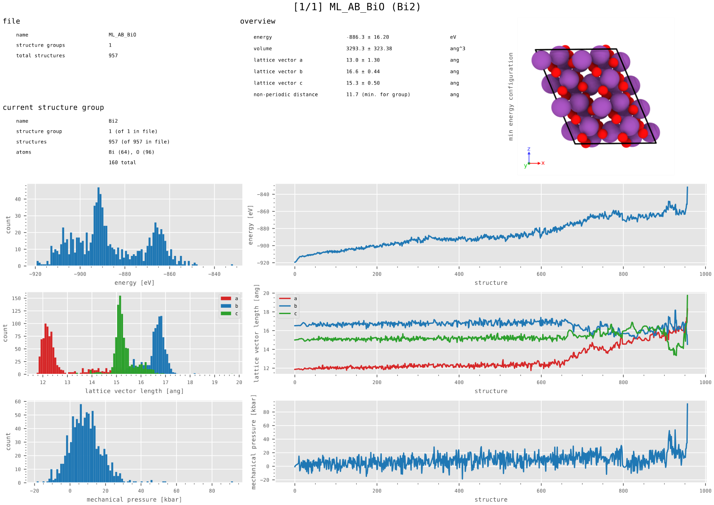
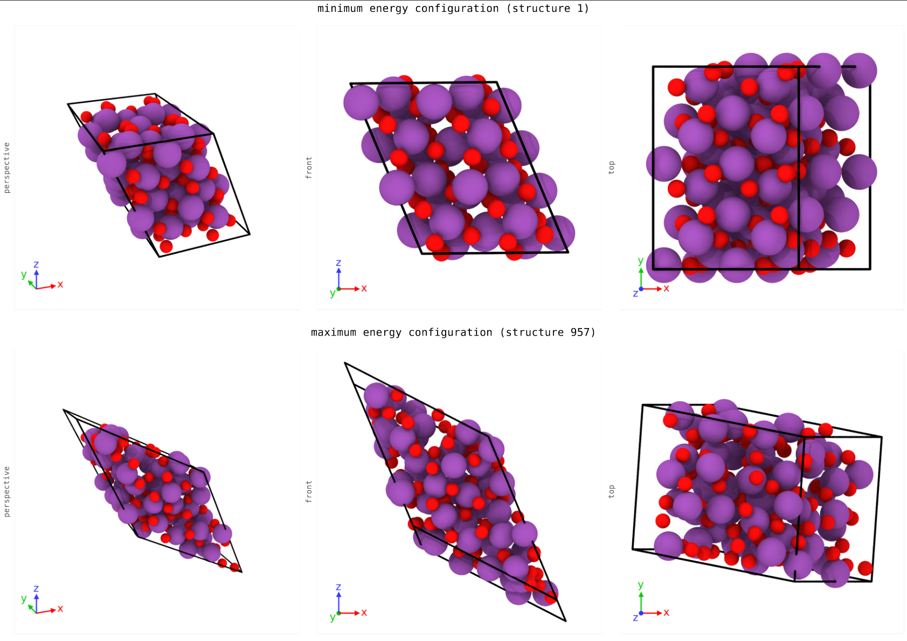
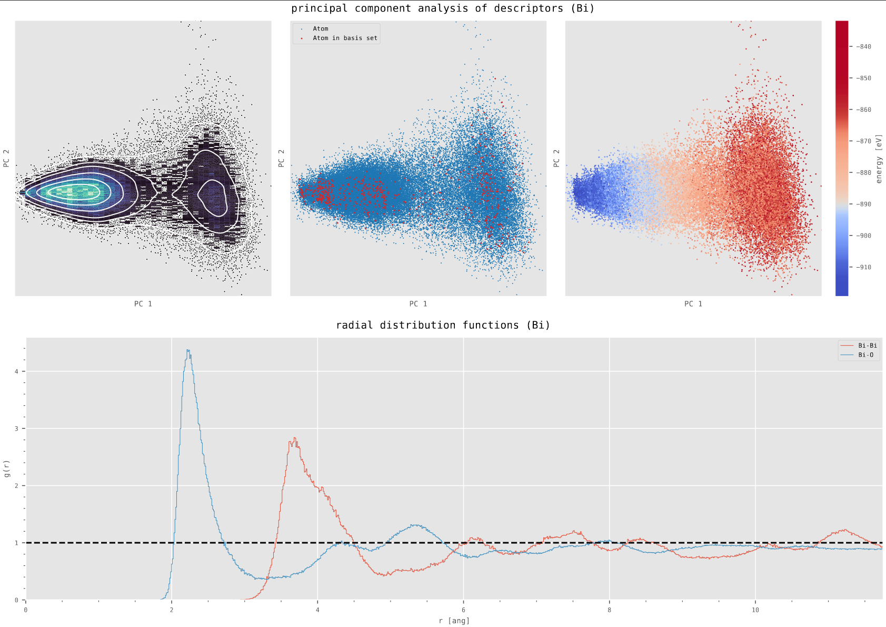

# FPdataViewer

Reads first-principle atomic structures files and graphs various statistics to provide a small overview of the file's content using matplotlib. 
Built around [VASP MLFF](https://www.vasp.at/wiki/index.php/Machine_learning_force_field_calculations:_Basics) [input and output files](https://www.vasp.at/wiki/index.php/ML_AB): ML_AB and ML_ABN.
Either saves to a PDF file (`plot`) or launches matplotlib (`plot --interactive`). 

Also provides some tools for converting between file types using [ASE](https://wiki.fysik.dtu.dk/ase/) 
(`convert`), repairing broken files (`validate`), and quickly inspecting the contents files (`inspect`). Some of these tools are also provided by the ASE CLI, and will become obsolete when the _vasp-mlab_ format is implemented).

|                  |                 |
|---------------------------------------------------|--------------------------------------------------|
|  |  |

## Table of contents

- [Installation](#installation-using-pip)
- [Requirements](#requirements)
- [Usage](#usage)
  - [plot](#fpdataviewer-plot)
  - [inspect](#fpdataviewer-inspect)
  - [convert](#fpdataviewer-convert)
  - [validate](#fpdataviewer-validate)
- [Config](#config-file)

## Installation

### pip

The easiest method is to install through pip.

```shell
pip install fpdataviewer
```

> Installation through pip is the preferred method, but will pull in a number of large libraries used in analysis, some of which may not be supported on Windows. 
> If this is not preferable, consider installing with `--no-deps` and using `--skip` to avoid said libraries (see [requirements](#requirements) and [options](#options)).

### conda

```shell
# NOT CURRENTLY AVAILABLE
```

## Requirements

Not all dependencies are required when `--skip` is used.

| Component                         | Dependencies (immediate)                                                                                                                                                                |
|-----------------------------------|-----------------------------------------------------------------------------------------------------------------------------------------------------------------------------------------|
| **required**                      | **[numpy](https://pypi.org/project/numpy/) [pandas](https://pypi.org/project/pandas/) [matplotlib](https://pypi.org/project/matplotlib/) [seaborn](https://pypi.org/project/seaborn/)** |
| **radial distribution functions** | **[numba](https://pypi.org/project/numba/)**                                                                                                                                            |
| **descriptors**                   | **[scikit-learn](https://pypi.org/project/scikit-learn/) [dscribe](https://pypi.org/project/dscribe/) (possible compatability issues)**                                                 |
| **rendering**                     | **[ovito](https://pypi.org/project/ovito/) [PySide6](https://pypi.org/project/PySide6/) [Pillow](https://pypi.org/project/Pillow/)**                                                    |

## Usage

### fpdataviewer plot

Main functionality. Graphs statistics into pdf or onto screen (with `--interactive``).

```shell
# Basic PDF generation
fpdataviewer plot -i examples/ML_AB -o overview.pdf

# Interactive plots
fpdataviewer plot -i examples/ML_AB --interactive

# Specify custom config
fpdataviewer plot -i examples/ML_AB --config mlab_viewer.json

# Skip radial distribution functions and image rendering, rasterize remaining graphs
fpdataviewer plot --rasterize --skip rdf img
```

<details>
<summary>Options</summary>

##### `--interactive`, `-x`
Save to a PDF file (`pdf`, default), show interactive plots (`plt`), or only print to console (`none`).

##### `--config <file>`, `-c`
See [Config file](#config-file).

##### `--skip <rdf/desc/img>`, `-s`
Skip calculations for radial distribution functions (`rdf`), descriptors (`desc`), or image rendering (`img`). Multiple can be selected. Useful when only certain statistics are needed.

##### `--strict`, `-t`
Validates the input file. 
Some formats (like VASP's ML_AB) contain redundant or possibly self-contradictory information that can cause parsers to fail unpredictably. 
This option will check the input file against specifications to minimize these errors and help the user repair the broken file.

##### `--rasterize`, `-r`
Disables vector image format for plots and uses raster images. This can greatly reduce file size when many descriptors are being drawn. Simply feeds `rasterize=True` to matplotlib.

</details>

### fpdataviewer inspect

Summarized file contents to console, no analysis. Recommened to use before plotting large files.

```shell
fpdataviewer inspect -i examples/ML_AB
```

<details>
<summary>Options</summary>

##### `--strict`, `-t`
Validates the input file. See `fpdataviewer validate`.

</details>

### fpdataviewer convert

Converts between file types using ASE. Useful for reading ML_AB files, otherwise recommended to use ASE CLI directly instead.

```shell
# Convert first structure in ML_AB file to a POSCAR file
fpdataviewer convert -i examples/ML_AB -o examples/POSCAR -f vasp-mlab -t vasp -x 0
```

<details>
<summary>Options</summary>

##### `--from`, `-f`
Source format; see [ASE documentation](https://wiki.fysik.dtu.dk/ase/ase/io/io.html) for options. Use `vasp-mlab` for ML_AB format.

##### `--to`, `-t`
Target format; see [ASE documentation](https://wiki.fysik.dtu.dk/ase/ase/io/io.html) for options.

##### `--index`, `-x`
Selects range of structures from source, in Python slice format (e.g. `0` for the first structure, `-1` for the last, `:4` for the first four, etc.).

##### `--append`, `-a`
Appends to end of the target file instead of overwriting.

</details>

### fpdataviewer validate

Validates the input file and reports problems. 
Some formats (like VASP's ML_AB) contain redundant or possibly self-contradictory information that can cause parsers to fail unpredictably. 
This option will check the input file against specifications to minimize these errors and help the user repair the broken file.

```shell
fpdataviewer validate -i examples/ML_AB
```

## Config file

Specifying a custom config will override settings from the default, which is located in [config.py](fpdataviewer/cli/config.py).

```json
{
  "global": {
    "bins": 100
  },
  "rdf": {
    "bins": 1000,
    "structures": 1.0,
    "r_min": 0.0,
    "r_max": "auto",
    "skip_pairs": []
  },
  "descriptors": {
    "structures": 1.0,
    "soap": {
      "r_cut": "auto",
      "n_max": 8,
      "l_max": 8
    }
  },
  "rendering": {
    "width": 1024,
    "height": 1024
  }
}
```

Most settings are self-explanatory, but more specifically:

- `"descriptors"`
  - See DScribe [documentation](https://singroup.github.io/dscribe/latest/doc/dscribe.descriptors.html). The inner content is fed to the respective (local) descriptor object. It should specify one of
    - `"soap"`
    - `"acsf"`
    - `"lmbtr"`
- `"rdf"`
  - `"skip_pairs"` is an array of values `"<atom 1>-<atom 2>"` (e.g. `"Bi-O"`). Usually RDF calculations are fast enough for this to be unnecessary.
- Anywhere
  - `"structures"` specify the number of structures to be included in some calculation, chosen at random. It should specify
    - `0.0 < x < 1.0` for a portion
    - `x > 1` for a specific number
  - `"auto"` will be replaced with the maximum possible radius such that radii never overlap in a periodic structure (the `non periodic distance` in the overview panel).
